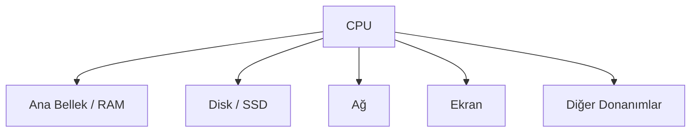
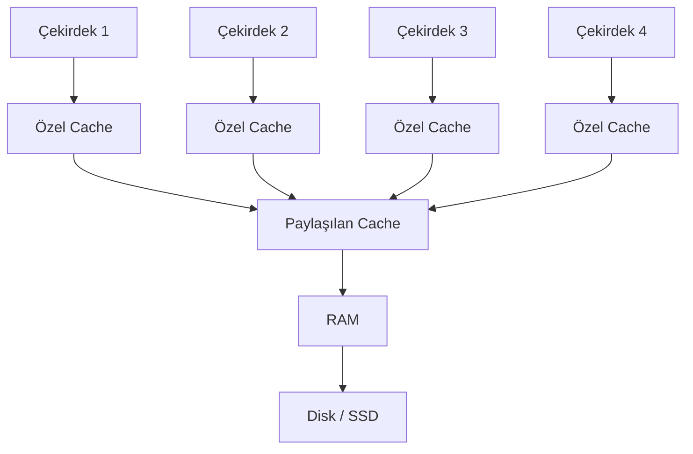

# Assembly Öncesi Bilgisayar Mimarisi Temelleri

> **Amaç:** Assembly öğrenmeye başlamadan önce bilgisayarın içeride nasıl çalıştığını, yazdığımız kodun CPU'ya nasıl ulaştığını ve işlemcinin veriyi nasıl işlediğini gündelik bir dille anlamak.

---

## İçindekiler

- [1. Neden bilgisayar mimarisi öğreniyoruz?](#1-neden-bilgisayar-mimarisi-öğreniyoruz)
- [2. Bütün yollar CPU'ya çıkar](#2-bütün-yollar-cpuya-çıkar)
- [3. CPU'nun en altında ne var?](#3-cpunun-en-altında-ne-var)
- [4. Mantık kapıları](#4-mantık-kapıları)
- [5. Basit kapılardan bilgisayara](#5-basit-kapılardan-bilgisayara)
- [6. Modern bilgisayarın temel parçaları](#6-modern-bilgisayarın-temel-parçaları)
- [7. CPU'nun içindeki temel birimler](#7-cpunun-içindeki-temel-birimler)
- [8. Bellek ve hız katmanları](#8-bellek-ve-hız-katmanları)
- [9. Çok çekirdekli işlemciler](#9-çok-çekirdekli-işlemciler)
- [10. Von Neumann mimarisi](#10-von-neumann-mimarisi)
- [11. Bunun güvenlikle ilgisi ne?](#11-bunun-güvenlikle-ilgisi-ne)
- [12. Bölüm özeti](#12-bölüm-özeti)
- [13. Mini alıştırmalar](#13-mini-alıştırmalar)
- [14. Cevap anahtarı](#14-cevap-anahtarı)
- [15. Kavram sözlüğü](#15-kavram-sözlüğü)

---

## 1. Neden bilgisayar mimarisi öğreniyoruz?

Assembly öğrenirken doğrudan komut ezberlemeye başlamak mümkündür. Örneğin `mov`, `add`, `sub` ve `jmp` gibi komutları görüp bunların ne yaptığını öğrenebiliriz.

Fakat işlemcinin ne olduğunu, yazmaçların neden kullanıldığını veya belleğin neden farklı katmanlara ayrıldığını bilmezsek assembly bir süre sonra anlamsız komutlardan oluşan bir listeye dönüşür.

Bu yüzden önce büyük resmi kurmamız gerekiyor:

```text
Yüksek seviyeli kod
        ↓
Derleyici veya yorumlayıcı
        ↓
Makine komutları
        ↓
CPU
        ↓
Mantık kapıları ve elektriksel işlemler
```

Yani assembly, yazılım dünyası ile işlemcinin gerçek çalışma biçimi arasında duran en önemli köprülerden biridir.

---

## 2. Bütün yollar CPU'ya çıkar

Python, Rust, C, JavaScript veya başka bir dil kullanıyor olabilirsin. Yazdığın programın görünüşü ne kadar farklı olursa olsun, bilgisayarın sonunda yapacağı şey aynıdır:

> CPU'nun anlayabileceği makine komutlarını çalıştırmak.

### Derlenen diller

Rust veya C gibi bir dilde yazılan kod genellikle bir **derleyici** tarafından makine koduna çevrilir.

```text
Rust/C kodu → Derleyici → Makine kodu → CPU
```

Derleyici, insanın okuyabileceği kodu işlemcinin anlayabileceği ikili komutlara dönüştürür.

### Yorumlanan diller

Python gibi dillerde ise arada bir **yorumlayıcı** bulunabilir.

```text
Python kodu → Python yorumlayıcısı → CPU
```

Burada önemli nokta şudur: Python kodunu doğrudan CPU çalıştırmaz. CPU, Python yorumlayıcısının makine kodunu çalıştırır; yorumlayıcı da senin yazdığın Python komutlarını yerine getirir.

### JIT kullanan sistemler

Bazı çalışma ortamları kodu çalışırken makine koduna çevirebilir. Buna **Just-In-Time Compilation**, kısaca **JIT** denir.

```text
Kaynak kod → Çalışma anında derleme → Makine kodu → CPU
```

JavaScript motorları ve bazı Python uygulamaları bu yaklaşımdan yararlanabilir.

### GPU tarafı

CUDA gibi teknolojilerde yazdığın kod CPU yerine GPU üzerinde çalışabilir. Ancak temel fikir değişmez:

- Kod bir donanımın anlayacağı komutlara çevrilir.
- Bu komutlar işlem birimleri tarafından yürütülür.
- Sonuçta her şey ikili seviyeye iner.

CPU ve GPU farklı amaçlara göre tasarlanmış olsalar da ikisi de komut alır, veri işler ve sonuç üretir.

---

## 3. CPU'nun en altında ne var?

Bir CPU'yu dışarıdan baktığımızda tek parça bir donanım gibi görürüz. İçine doğru indikçe karşımıza milyonlarca veya milyarlarca küçük elektronik yapı çıkar.

Bu yapıların temelinde **mantık kapıları** bulunur.

Mantık kapısını şöyle düşünebilirsin:

> Çok basit bir soruya çok hızlı cevap veren küçük bir karar mekanizması.

Örneğin:

- İki giriş de açık mı?
- Girişlerden en az biri açık mı?
- Girişlerin yalnızca biri açık mı?
- Gelen değerin tersini üretmeli miyim?

Tek bir mantık kapısı çok etkileyici görünmez. Fakat çok sayıda kapıyı doğru şekilde bir araya getirdiğimizde toplama yapan, veri seçen, bilgi saklayan ve sonunda program çalıştıran sistemler ortaya çıkar.

---

## 4. Mantık kapıları

Bu bölümde dört temel mantık kapısını inceleyeceğiz:

- AND
- OR
- XOR
- NOT

Mantıksal gösterimde genellikle:

- `1` = doğru, açık veya sinyal var
- `0` = yanlış, kapalı veya sinyal yok

anlamında kullanılır.

Gerçek donanımda bu değerler belirli voltaj seviyeleriyle temsil edilebilir. Fakat aynı mantık ışıkla, suyla veya oyun içindeki sistemlerle de kurulabilir.

### 4.1 AND kapısı

AND kapısı, yalnızca iki giriş de doğruysa doğru sonuç üretir.

Gündelik örnek:

> Kasayı açmak için hem anahtarın hem de şifrenin doğru olması gerekiyor.

| A | B | A AND B |
|---:|---:|---:|
| 0 | 0 | 0 |
| 0 | 1 | 0 |
| 1 | 0 | 0 |
| 1 | 1 | 1 |

Kısaca:

```text
İkisi de doğruysa sonuç doğru.
```

### 4.2 OR kapısı

OR kapısı, girişlerden en az biri doğruysa doğru sonuç üretir.

Gündelik örnek:

> Eve otobüsle veya metroyla gidebilirsin. İkisinden birinin çalışması yeterlidir.

| A | B | A OR B |
|---:|---:|---:|
| 0 | 0 | 0 |
| 0 | 1 | 1 |
| 1 | 0 | 1 |
| 1 | 1 | 1 |

Su benzetmesiyle düşünürsek iki borudan herhangi birinden su gelmesi, çıkıştan su akması için yeterli olabilir.

### 4.3 XOR kapısı

XOR, yani **Exclusive OR**, yalnızca girişlerden biri doğruysa doğru sonuç üretir.

İki giriş de aynıysa sonuç yanlış olur.

Gündelik örnek:

> Bir lambayı iki farklı düğmeyle kontrol ettiğini düşün. Düğmeler farklı durumdaysa lamba yanıyor, aynı durumdaysa sönüyor.

| A | B | A XOR B |
|---:|---:|---:|
| 0 | 0 | 0 |
| 0 | 1 | 1 |
| 1 | 0 | 1 |
| 1 | 1 | 0 |

Kısaca:

```text
Sadece biri doğruysa sonuç doğru.
```

### 4.4 NOT kapısı

NOT kapısı tek giriş alır ve gelen değeri tersine çevirir.

| A | NOT A |
|---:|---:|
| 0 | 1 |
| 1 | 0 |

Gündelik örnek:

> “Kapı açık değilse kilitlidir” gibi bir tersleme düşüncesi.

---

## 5. Basit kapılardan bilgisayara

Mantık kapıları tek başlarına yalnızca çok küçük kararlar verir. Asıl güç, bu kapılar birleştirildiğinde ortaya çıkar.

### 5.1 Toplayıcı devreler

Mantık kapılarıyla iki bitlik değer toplayan devreler oluşturulabilir.

Örneğin:

```text
1 + 1 = 10
```

İkili sistemde bu işlem yapılırken:

- Sonuç biti hesaplanır.
- Gerekirse bir **elde** veya **taşıma biti** üretilir.

Bu küçük toplama devreleri yan yana getirilerek daha büyük sayıların toplanması sağlanabilir.

Yani işlemcide gördüğümüz büyük hesaplama yeteneği, en temelde çok sayıda küçük kararın birlikte çalışmasıdır.

### 5.2 Çoklayıcı — Multiplexer

Çoklayıcı, birden fazla giriş arasından hangisinin çıkışa gönderileceğini seçer.

Bunu televizyon kumandası gibi düşünebilirsin:

- Birden fazla kanal vardır.
- Sen bir kanal numarası seçersin.
- Ekrana yalnızca seçilen kanal gelir.

Bilgisayarda da hangi verinin okunacağı veya hangi yolun kullanılacağı buna benzer seçim mekanizmalarıyla belirlenebilir.

### 5.3 Bellek oluşturmak

Mantık kapılarının belirli şekillerde bağlanmasıyla tek bitlik bilgi saklanabilir.

Bu çok önemli bir geçiştir. Çünkü artık sistem yalnızca gelen veriye cevap vermekle kalmaz; geçmişteki bir durumu da hatırlayabilir.

```text
Hesaplama + Durum saklama = Program çalıştırabilen sistemlerin temeli
```

Bir kapı yalnız başına bilgisayar değildir. Fakat kapılar birleşerek:

- toplama yapabilir,
- seçim yapabilir,
- bilgi saklayabilir,
- komutları takip edebilir.

Böylece basit fiziksel sinyallerden gerçek bir bilgisayar ortaya çıkar.

### Oyunlarda mantık devreleri

Bu mantığı yalnızca elektronik devrelerde görmek zorunda değiliz.

- Minecraft'ta Redstone kullanılarak mantık devreleri kurulabilir.
- Bazı oyunlarda su akışıyla hesaplama sistemleri yapılabilir.
- Işık veya mekanik parçalarla aynı mantığın fiziksel örnekleri oluşturulabilir.

Kullanılan malzeme değişir, fakat karar mantığı aynı kalır.

---

## 6. Modern bilgisayarın temel parçaları

Modern bir bilgisayarı çok yüksek seviyeden şu şekilde düşünebiliriz:



CPU tek başına yeterli değildir. İşlemci sürekli olarak diğer bileşenlerle veri alışverişi yapar.

### CPU

Komutları yürütür ve hesaplama yapar.

### Ana bellek — RAM

Programların aktif olarak kullandığı kod ve veriler burada tutulur.

### Disk veya SSD

Dosyalar ve programlar uzun süreli olarak burada saklanır.

### Ağ

Bilgisayarın başka sistemlerle iletişim kurmasını sağlar.

### Ekran ve diğer çevre birimleri

İşlem sonucunun kullanıcıya gösterilmesini veya dış dünyadan veri alınmasını sağlar.

---

## 7. CPU'nun içindeki temel birimler

CPU, içinde ne olduğu belli olmayan tek parça bir kutu değildir. Kendi içinde farklı görevleri olan bölümler bulunur.

### 7.1 Yazmaçlar — Registers

Yazmaçlar, CPU'nun içinde bulunan çok küçük ve çok hızlı depolama alanlarıdır.

Bunları çalışma masasının üzerindeki alan gibi düşünebilirsin:

- Sık kullandığın şeyleri masanın üzerinde tutarsın.
- Her seferinde dolaba gitmek zorunda kalmazsın.
- Masa çok hızlıdır ama alanı sınırlıdır.

CPU da üzerinde işlem yapacağı verileri yazmaçlara alır.

Assembly öğrenirken yazmaçlarla sürekli karşılaşacağız. Çünkü birçok assembly komutu doğrudan yazmaçlar üzerinde çalışır.

Örnek fikir:

```asm
mov rax, 5
mov rbx, 3
add rax, rbx
```

Bu örnek yalnızca mantığı göstermek içindir:

1. `rax` yazmacına `5` koyulur.
2. `rbx` yazmacına `3` koyulur.
3. İki değer toplanır.

### 7.2 Kontrol birimi — Control Unit

Kontrol birimi, CPU içindeki trafik polisi gibidir.

Görevleri genel olarak şunlardır:

- Sıradaki komutu belirlemek,
- Komutu çözümlemek,
- Gerekli birimlere ne yapacaklarını söylemek.

Örneğin işlemci bir toplama komutu gördüğünde, ilgili verilerin hazırlanmasını ve aritmetik birimin çalışmasını sağlar.

### 7.3 Aritmetik Mantık Birimi — ALU

ALU, yani **Arithmetic Logic Unit**, işlemcinin temel hesaplama bölümüdür.

Burada şu tür işlemler yapılabilir:

- Toplama
- Çıkarma
- AND
- OR
- XOR
- Karşılaştırma

Assembly komutlarının önemli bir kısmı ALU'nun yapabildiği işlemlerle doğrudan bağlantılıdır.

### 7.4 Diğer birimler

Modern işlemcilerde yalnızca bu üç bölüm yoktur. Örneğin kayan noktalı sayılar için özel işlem birimleri bulunabilir.

Ancak başlangıç seviyesinde şu üçlü büyük resmi kurmak için yeterlidir:

```text
Yazmaçlar → Veriyi kısa süreli tutar.
Kontrol birimi → Ne yapılacağını yönetir.
ALU → Hesaplama ve mantık işlemlerini yapar.
```

---

## 8. Bellek ve hız katmanları

Bilgisayardaki bütün depolama alanları aynı hızda değildir.

Genel kural şudur:

> Bir depolama alanı CPU'ya ne kadar yakınsa genellikle o kadar hızlı, küçük ve pahalıdır.

Kaynakta anlatılan genel sıralama şu şekildedir:

```text
İnternet → Disk → RAM → Cache → Registers
Yavaş                                  Hızlı
Büyük                                  Küçük
```

### 8.1 İnternet

İnternet üzerinde çok büyük miktarda veri bulunabilir. Fakat bu veriye ulaşmak için ağ üzerinden paket gönderilmesi gerekir.

Bu yüzden erişim süresi yerel depolamaya göre daha yüksektir.

### 8.2 Disk veya SSD

Bilgisayarındaki dosyalar burada tutulur. İnternete göre daha hızlı ve yereldir, fakat CPU'nun doğrudan üzerinde çalışması için yine de yavaştır.

Bir oyun oynarken her küçük dosyanın sürekli diskten okunması performansı düşürür. Bu nedenle aktif verilerin RAM'e alınması istenir.

### 8.3 RAM

RAM, çalışan programların aktif verilerini tutar.

Diskten daha hızlıdır, ancak CPU'nun içindeki önbellek ve yazmaçlardan daha yavaştır.

### 8.4 Cache — Önbellek

Cache, CPU'ya yakın duran hızlı bir ara depolama alanıdır.

Buzdolabı benzetmesi yapalım:

- Market = İnternet
- Evdeki büyük kiler = Disk
- Buzdolabı = RAM
- Masanın üstündeki tabak = Cache
- Elindeki lokma = Register

İhtiyacın olan şey eline ne kadar yakınsa ona o kadar hızlı ulaşırsın. Ancak elinde veya masanın üzerinde tutabileceğin şeylerin miktarı sınırlıdır.

### 8.5 Registers — Yazmaçlar

Yazmaçlar bu zincirin en hızlı ve en küçük bölümlerindendir.

CPU, gerçek hesaplamalarını büyük ölçüde yazmaçlardaki değerler üzerinde gerçekleştirir. Diğer katmanlardaki veriler gerektiğinde içeri alınır, işlenir ve sonra tekrar dışarı yazılır.

### Hız ve kapasite ilişkisi

| Katman | Genel hız | Genel kapasite | CPU'ya yakınlık |
|---|---|---|---|
| İnternet | Çok yavaş | Çok büyük | Çok uzak |
| Disk/SSD | Yavaş | Büyük | Uzak |
| RAM | Orta | Orta | Daha yakın |
| Cache | Çok hızlı | Küçük | Çok yakın |
| Register | En hızlı katmanlardan | Çok küçük | CPU'nun içinde |

Bu tablo kesin süre veya boyut vermek için değil, katmanlar arasındaki temel ilişkiyi göstermek içindir.

### Veri neden katmanlar arasında taşınıyor?

Çünkü tek bir depolama teknolojisi aynı anda şu üç özelliği kusursuz biçimde sunamaz:

- Çok büyük kapasite
- Çok yüksek hız
- Düşük maliyet

Bu nedenle bilgisayarlar farklı özelliklere sahip katmanları birlikte kullanır.

---

## 9. Çok çekirdekli işlemciler

Günümüzde işlemcilerin çoğunda birden fazla çekirdek bulunur.

Her çekirdeği ayrı bir çalışan gibi düşünebilirsin:

- Her çalışanın kendi küçük çalışma alanı vardır.
- Bazı kaynaklar kişiye özeldir.
- Bazı kaynaklar ekip tarafından ortak kullanılır.

Bir çekirdeğin kendi yazmaçları ve bazı özel önbellek alanları bulunabilir. Bunun yanında birden fazla çekirdeğin paylaştığı önbellek katmanları da olabilir.

Basitleştirilmiş görünüm:



Bu yapı performansı artırabilir, ancak aynı veriye birden fazla çekirdeğin erişmesi gibi durumlarda sistemi daha karmaşık hale getirir.

---

## 10. Von Neumann mimarisi

Modern bilgisayarları anlamak için önemli kavramlardan biri **Von Neumann mimarisi**dir.

Bu yaklaşımın dikkat çekici taraflarından biri, program komutlarıyla verilerin aynı genel bellek yapısı içinde tutulabilmesidir.

Yani bellekte şunların ikisi de bulunabilir:

- İşlenecek veri
- Çalıştırılacak kod

Basitleştirilmiş akış:


CPU bellekten bir şey alırken, alınan bitlerin nasıl yorumlanacağı bağlama bağlıdır:

- Bunlar bir komut olabilir.
- Bir sayı olabilir.
- Bir adres olabilir.
- Bir karakter olabilir.

Bilgisayar için hepsi en temelde bitlerden oluşur.

Bu durum assembly ve güvenlik açısından çok önemlidir. Çünkü işlemcinin bir veriyi “kod” olarak çalıştırması veya bir adresi yanlış yorumlaması ciddi sonuçlara yol açabilir.

---

## 11. Bunun güvenlikle ilgisi ne?

Bilgisayar mimarisi yalnızca donanım merakı için öğrenilmez. Binary exploitation, reverse engineering ve düşük seviyeli güvenlik çalışmalarında bu bilgiler doğrudan kullanılır.

### Yazmaçları bilmeden program akışı anlaşılmaz

Bir fonksiyon çağrılırken parametreler yazmaçlarda taşınabilir. Dönüş değerleri belirli yazmaçlarda bulunabilir. Programın nereye döneceği veya hangi adres üzerinde çalıştığı da düşük seviyede izlenebilir.

### Bellek katmanlarını bilmeden veri hareketi anlaşılmaz

Programdaki bir değerin diskten RAM'e, RAM'den cache'e ve oradan yazmaca gelmesi bilgisayarın temel çalışma şeklidir.

### Kod ve veri ilişkisi güvenlik sorunlarına zemin hazırlar

Bellekte bulunan verinin yanlışlıkla komut gibi yorumlanması, kontrol akışının değiştirilmesi veya programın beklemediği bir adrese yönlendirilmesi güvenlik açısından kritik olabilir.

### Assembly neden gerekli?

Çünkü yüksek seviyeli kod bize programcının niyetini gösterir. Assembly ise işlemcinin gerçekten ne yaptığını gösterir.

Örneğin yüksek seviyede şunu görebiliriz:

```c
result = a + b;
```

Assembly seviyesinde ise şu sorular önem kazanır:

- `a` nerede tutuluyor?
- `b` hangi yazmaçta?
- Sonuç hangi yazmaca yazılıyor?
- İşlemden sonra hangi bayraklar değişiyor?
- Belleğe erişim yapılıyor mu?

Bu sorular reverse engineering ve exploit geliştirme çalışmalarının temelidir.

---

## 12. Bölüm özeti

Bu bölümden akılda kalması gereken ana noktalar şunlardır:

1. Hangi programlama dilini kullanırsak kullanalım, işlemler sonunda bir işlem biriminde makine komutları olarak yürütülür.
2. CPU'nun temelinde çok sayıda mantık kapısı bulunur.
3. AND, OR, XOR ve NOT gibi basit kapılar birleştirilerek daha karmaşık devreler oluşturulur.
4. Mantık kapıları toplama yapabilir, giriş seçebilir ve bilgi saklayabilir.
5. CPU içinde yazmaçlar, kontrol birimi ve ALU gibi farklı bölümler bulunur.
6. Depolama katmanlarında CPU'ya yaklaştıkça hız artar, kapasite genellikle azalır.
7. Modern işlemciler birden fazla çekirdeğe ve farklı önbellek seviyelerine sahip olabilir.
8. Von Neumann yaklaşımında kod ve veri aynı genel bellek yapısında tutulabilir.
9. Bu konular assembly, reverse engineering ve binary exploitation öğrenmek için temel oluşturur.

---

